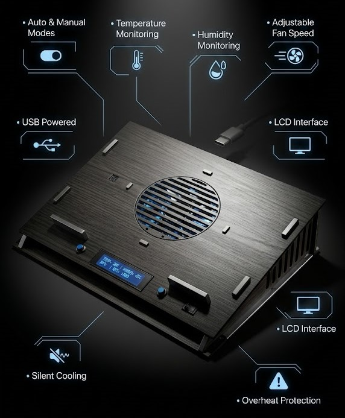

# ❄️ Smart Cooling Pad

> An Arduino-based intelligent cooling pad that automatically adjusts fan speed based on laptop temperature, providing efficient cooling, real-time monitoring, and manual control.
<p align="center">
  
</p>

---

## 📌 Overview

The **Smart Cooling Pad** is an embedded systems project designed to improve laptop cooling performance while enhancing user comfort.

The system continuously monitors temperature using a digital sensor and automatically adjusts the cooling fan speed. It also allows manual fan control and displays all system information on a 16x4 LCD.

---

## ✨ Features

- 🌡️ Real-time Temperature Monitoring
- 💧 Humidity Measurement
- 🤖 Automatic Fan Speed Control
- 🎛️ Manual Fan Speed Adjustment
- 🚨 Overheat Warning LED
- 🖥️ 16x4 LCD Display
- 💡 Adjustable LCD Brightness
- 🔌 USB Powered
- ⚡ ON/OFF Fan Switch
- 🧩 Custom PCB Design
- 🪵 Custom Cooling Pad Casing

---

# 📷 Project Preview

> Add project images here

| Final Product | PCB | Circuit |
|---------------|-----|---------|
| Image | Image | Image |

---

# ⚙️ System Operation

```text
Temperature Sensor
        │
        ▼
Arduino Mega
        │
 ┌──────┴────────┐
 │               │
 ▼               ▼
LCD Display   Fan Controller
 │               │
 ▼               ▼
Temperature    PWM Fan Speed
Humidity       LED Alert
System Status
```

---

# 🔧 Hardware Components

| Component | Quantity |
|-----------|----------|
| Arduino Mega | 1 |
| AM2320 Temperature & Humidity Sensor | 1 |
| LCD 16x4 Display | 1 |
| 5V Cooling Fan | 1 |
| 10k Potentiometer | 2 |
| Push Button | 1 |
| LED Indicator | 1 |
| 2N2222A NPN Transistor | 1 |
| 1N4007 Diode | 1 |
| 1kΩ Resistors | 2 |

---

# 🧠 System Modes

## 🤖 Automatic Mode

The cooling fan speed is automatically adjusted according to the measured temperature.

### Functions

- Read temperature continuously
- Control fan speed automatically
- Display temperature
- Display humidity
- Display fan speed
- Display system status
- Activate warning LED if temperature exceeds **27°C**

---

## 🎛️ Manual Mode

The user controls the fan speed manually using a potentiometer.

### Functions

- Manual fan speed control
- Real-time LCD monitoring
- Temperature monitoring
- Humidity monitoring

---

## ⏹️ Fan OFF Mode

When the switch is OFF:

- Fan stops completely
- LCD keeps displaying temperature
- Sensor continues monitoring

---

# 🖥️ LCD Display

The LCD shows:

- 🌡️ Temperature
- 💧 Humidity
- ⚙️ Fan Speed
- 🔄 Current Mode
- 📢 System Status

---

# ⚡ Circuit Design

The project includes:

- Arduino-based control circuit
- Fan driver circuit
- Transistor switching stage
- Protection diode
- LCD interface
- Temperature sensor interface
- Manual control potentiometers

---

# 🟦 PCB Design

A custom PCB was designed to:

- Improve reliability
- Reduce wiring complexity
- Increase durability
- Enhance electrical performance
- Create a professional final product

---

# 🪵 Mechanical Design

The cooling pad includes:

- Top Plate
- Bottom Plate
- Side Panels
- Fan Cover
- Fan Mount
- Laptop Support
- Custom Enclosure

Designed using CAD before manufacturing.

---

# 📊 Performance Testing

The cooling performance was experimentally evaluated.

| Test | Temperature | Time |
|------|-------------|------|
| Test 1 | 40°C → 35°C | 72 s |
| Test 2 | 35°C → 30°C | 70 s |
| Test 3 | 30°C → 25°C | 62 s |

### 📈 Average Cooling Rate

**4.44 °C/min**

---

# 🏆 Project Advantages

- ✅ Automatic cooling
- ✅ Manual control
- ✅ LCD monitoring
- ✅ Temperature alert
- ✅ USB powered
- ✅ Custom PCB
- ✅ Low manufacturing cost
- ✅ User-friendly interface

---

# ⚠️ Current Limitations

- Limited cooling for high-performance laptops
- Dust accumulation over time
- Doesn't fit every laptop size
- Limited maximum airflow

---

# 🚀 Future Improvements

- 🔋 Rechargeable Battery
- 🌐 Wi-Fi / Bluetooth Control
- 📱 Mobile Application
- 🌬️ Brushless Silent Fans
- 🪶 Carbon Fiber Chassis
- 📈 Temperature Data Logging
- 🤖 AI-based Cooling Prediction

---

# 🛠️ Software

- Arduino IDE
- Embedded C++
- PWM Fan Control
- AM2320 Sensor Library

---

# 📄 License

This project is developed for educational purposes as part of the **Electronics for Instrumentation (MCT232)** course.

---
